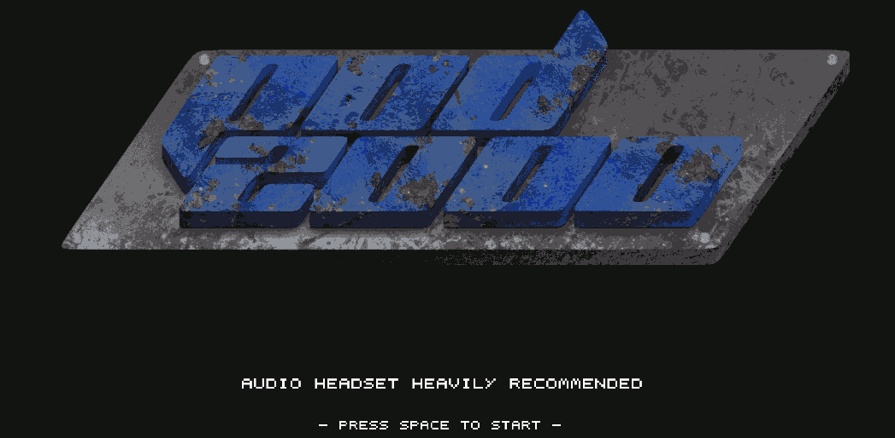

# Pod2000

Exploration game built as a team, from scratch (graphics, audio and game design) for the LudumDare 38 \o/

[Here is the LDJAM submission](https://ldjam.com/events/ludum-dare/38/$23220)

# Demo

You can [play to the demo here](https://grena.itch.io/pod2000)

The demo is deployed on the `gh-pages` branch versionning the `build/bundles.js` file (npm run build to update).

# Screenshots





# Getting Started

### Pre-requisites

You need to have `node` and `npm` installed

### Dependencies

To install dependencies, run:
```
npm install
```

This will install all required local dependencies

### Building the project

To build project you can use:

```
npm run build
```

### Running in dev mode:

```
npm run dev
```

# Special thanks

Thx @wlk for the following boilerplate https://github.com/wlk/phaser-typescript-boilerplate
